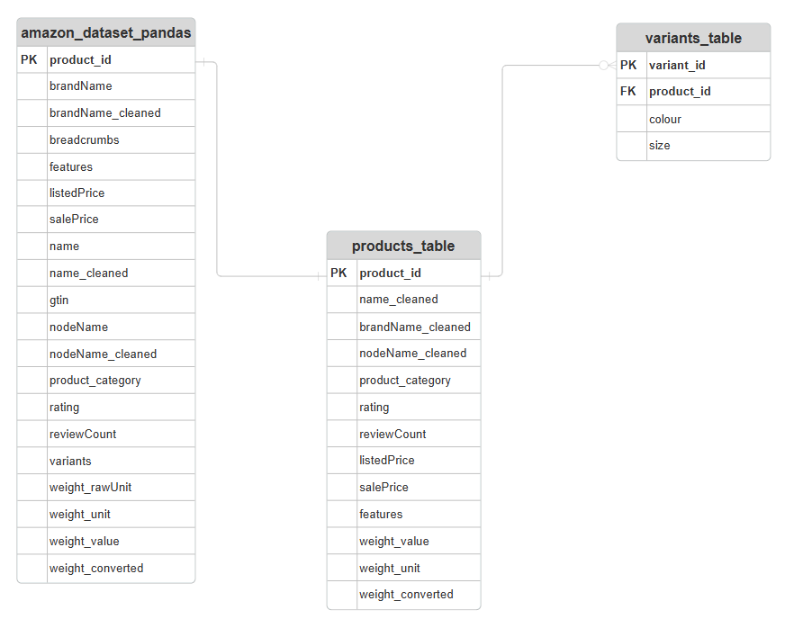

# Data Schema
| Column Name | Description | Type |
|-------------|-------------|------|
| additionalProperties | A collection of product-specific details, including MPAA rating, dimensions, media format, run time, release date, actors, dubbed languages, studio, ASIN, country of origin, and best sellers rank. | string |
| brandName | The brand or manufacturer name of the product. Useful for filtering and identifying products from specific brands. | string |
| breadcrumbs | A hierarchical list of categories that the product belongs to, often used for navigation and filtering. | string |
| color | The color or color combination of the product. Useful for filtering and product selection based on visual appeal. | string |
| currency | The currency code for the product's price, typically USD. | string |
| current_depth | The current depth of the item within a hierarchical category structure. | integer |
| description | A concise textual description of the product. | string |
| descriptionRaw | The raw HTML or markup version of the product description. | string |
| features | A list of key product features often presented as bullet points describing characteristics or benefits. | string |
| gtin | The Global Trade Item Number used to uniquely identify the product in commerce. | string |
| imageUrls | A list of URLs pointing to images of the product. | string |
| inStock | Indicates whether the product is currently available in stock. | string |
| listedPrice | The listed price of the product. | float |
| material | The primary material from which the product is made. | string |
| mpn | The manufacturer part number used for product identification. | string |
| name | The name or title of the product including brand, model, and attributes. | string |
| new_path | The category path representing the product’s location in the hierarchy. | string |
| nodeName | The name of the product category indicating the top-level grouping. | string |
| rating | The average product rating based on user reviews. | float |
| reviewCount | The total number of user reviews submitted for the product. | float |
| salePrice | The current sale price of the product. | float |
| scrapedDate | The date and time when the product data was scraped (ISO 8601 format). | string |
| size | The dimensions and weight of the product formatted as a string. | string |
| sku | The unique Stock Keeping Unit identifier for the product. | string |
| style | The style or design variation of the product. | string |
| url | The URL of the product page on Amazon. | string |
| variants | A list of product variants with attributes such as size. | string |
| weight_rawUnit | The original unit of weight measurement from the product page. | string |
| weight_unit | The standardized unit of weight measurement. | string |
| weight_value | The numerical value of the product’s weight. | float |

# Data Cleaning Process log

### Removing Unnecessary Columns
In the beginning of the data cleaning process, I have decided to drop the columns that is not meaningful for analysis. The columns being kept for analysis are:
* **rating**: Needed for rating vs popularity analysis
* **reviewCount**: Proxy for sales popularity
* **brandName**: Needed for brand dominance analysis
* **nodeName**: Category comparison
* **listedPrice**: Original pricing
* **salePrice**: Discount / competitive pricing
* **name**: Detect bundled products
* **features**: Sometimes indicates bundles
* **weight_unit**: Needed for converting weight values
* **weight_value**: Needed for converting weight values
* **variants**: Needed for evaluating attributes of products

Note: Some columns in the **amazon_dataset_pandas** csv file was kept to show values transferred to corresponding column

### Removing null values, misplaced values on listedPrice and SalePrice
If there are null values on both listed price and sales price, my analysis cannot be answered. While examining the columns I also found out there were misplaced values inside **salePrice** column which was meant to be in other columns. Thankfully, these misplaced values existed in their correct columns, it was just an error during the data scraping. By using Python(Pandas), missing/wrong values **listedPrice** column were filled using the corresponding **salePrice** values, if they had one. Rows with both prices missing were removed to maintain pricing integrity for analysis.

### Converting Weight value
Since the dataset was sourced from Amazon US, product weights were recorded in pounds and ounces. With Power Query, these values were standardized by converting all weights into grams to ensure consistency and to help with my future analysis.

### Misplaced values in gtin column
Some values in the **gtin** column contained misplaced values that were intended for the **nodeName** column. These values were transferred to correct column for the accurate data alignment.

### Inconsistent names in brandName column
The **brandName** column contained inconsistent values, while some values were in their correct brand name, some values started with **Brand:** prefix, some with not even a correct brand name. With Power Query, I splitted prefix, and rows with unresolvable values were replaced with "Unknown Brand" in a new column **brandName_cleaned**. 

### nodeName cleaning
Due to a common web-scraping issue, some values that were intended for the nodeName column were incorrectly placed in the gtin column. Using Power Query, a new column called nodeName_cleaned was created to correct and consolidate the category information. To simplify the category structure for analysis, only the top-level product category was extracted from the hierarchical path. This was done by creating a product_category column using the Text Before Delimiter transformation.

### Splitting the JSON list in the variants column
The **variants** column contained JSON-like lists representing product attributes such as colour and size. In case I needed the "size" attribute for my future analysis, I decided to use Pandas in Python to parse the JSON strings and extract individual attributes. The issue here was since each product contained multiple variant attributes, which lead to significant row duplication if stored directly in the main dataset. To resolve this, I decided to assign each product a **product id**, and make a new csv file called **variants_table** which will be linked with **product_id** with a **products_table** csv. In the **variants_table**, each variant is stored with their own **variant_id**, and the **product_id** is used as foreign key to establish the relationship between two tables. This structure dreduces redundancy and creates a cleaner relational model that is easier to query and analyze. 
#### ERD diagram showing the entity relationship between **amazon_dataset_pandas**, **products_table** and **variants_table**:

