# Deep Analysis
This document presents a comprehensive breakdown of the Amazon Best Sellers dataset used in this project. The main focus of this analysis is to find the underlying patterns that influence product success on Amazon's marketplace.

By analyzing pricing strategies, brand dominance, customer sentiment and different types of product packaging, this study aims to answer the four main key analysis questions. 

My goal of this analysis was not only to visualize trends, but also interpret them in a way that simulated real business decision-making. Each question is designed to be from an executive perspective, focusing on insights that marketing teams and product managers would use to guide themselves. 

## 1. Do higher product ratings drive product popularity?
Ratings from customers reflect their satisfaction from the products. This question was to find out whether highly rated products also attract significantly more customer engagement, measured through the product's review count.

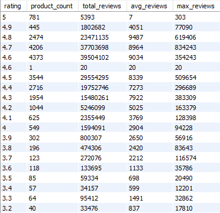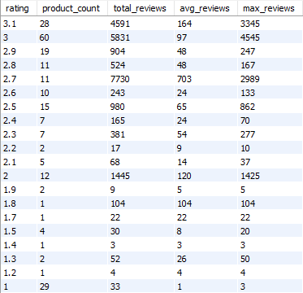

Here the column **total_reviews** refers to the total number of reviews across all products within the rating, **average_reviews** refers to the average number of reviews per product in that rating group, and **max_reviews** refers to the single product with the highest number of reviews within that rating group.

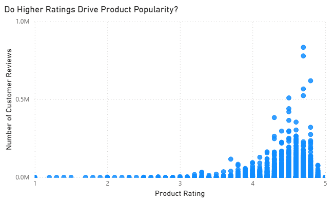

To visualize this question, I created a scatter plot using product rating on the x-axis and number of customer reviews on the y-axis. The initial visualization was heavily skewed due to a small number of products with extremely large review counts, which compressed the rest of the data. To address this issue and make patterns easier to interpret, I applied a logarithmic scale to the y-axis.

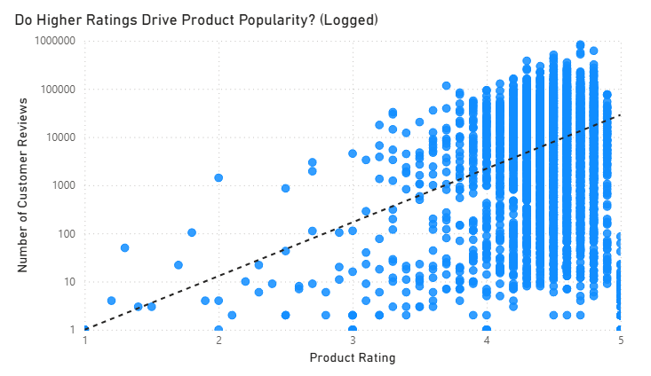

After applying log scale on the graph, the pattern and correlation became much easier to interpret. 

To further examine the relationship between product ratings and product reviews, the dataset was aggregated at the product level using **product_id**. The average rating and total number reviews were calculated for each product.

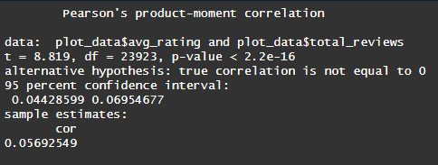

Here shows a summary of pearson correlation test done using R in RStudio. As the p-value is less than 0.05 and r = 0.057(2 d.p), the results show a statistically significant but very weak positive correlation between average rating and total review count. This indicates that while higher-rated products tend to have slightly more reviews, the strength of this relationship is very weak. This shows rating alone does not strongly influence product popularity. Other factors such as brand recognition, product visibility and exceptional marketing strategies could show higher influence in product popularity. An important idea to consider here is since the sample size is very large(More than 25k+ products), the statistical significance is highly likely to be driven by it, rather than a meaningful relationship between the two variables.

**Most products with a high number of reviews have ratings above 4.0 stars.** This suggests a social proof feedback loop: people prefer to buy products that are well-made, and a high rating increases visibility, which in turn leads to more reviews.

**Many highly rated products still receive relatively few reviews.**  This observation directly supports the weak correlation seen on the scatter plot, it proves that **high rating** is not a guaranteed factor for popularity. Even products rated with 5 star could remain low review counts. 

## 2. Which Brands dominate Best-seller rankings across different categories?
Brands play a major role in shaping customer trust and purchase decisions. This question aims to identify whether certain brands consistently appear among best-sellers across multiple product categories, indicating strong market dominance and brand influence.

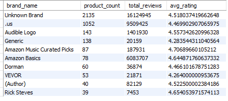

Here I used SQL query to identify the top 10 brands within the best-seller dataset. The data is grouped by brand name, and each brand is evaluated based on the number of products it has listed, which represents its presence in the best-seller market. The results are then sorted in descending order of product count, allowing us to clearly see which brands dominate the dataset in terms of volume.

**NOTE**: Entries labelled as “Unknown Brand” and the invalid brand name “.us” were excluded from the following analysis, as they were originally null values inside the brand_name column, and do not provide meaningful or reliable insights for evaluating brand performance. 

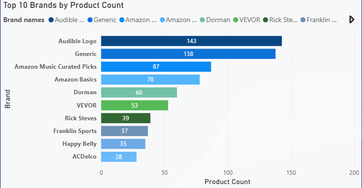

It can be observed that the brand with the highest number of products in the best-seller dataset is Audible (listed as “Audible Logo”), a subsidiary of Amazon that specialises in audiobooks and audio-based content.

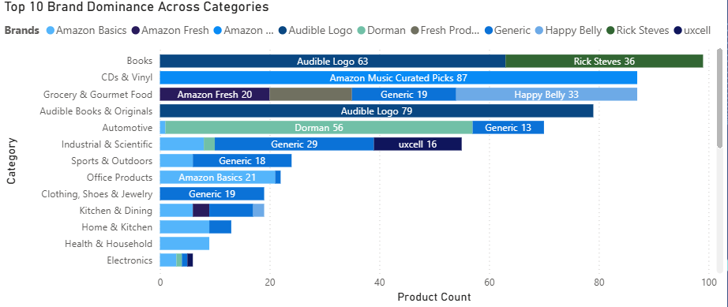

#### Observations:
* **Amazon's private labels(Amazon Music, Audible, Amazon Basics) dominate**  categories for curated or proprietary products. With Amazon-owned brands consistenyl appearing among the top positions in categories such as digital media and platform controlled products, these brands benefit themselves, while making it difficult for other competitors to gain attraction in these categories. 
* **In niche or specialized categories such as Automotive, Books, and CDs & Vinyl, a single brand often dominates**. Strong brand loyalty plays a key role in markets that are in niche, suggesting that other brands must show different aspects, something special about them for an effective competition.
* **In contrast, utility categories like Grocery, Kitchen, and Home are less saturated, showing a more fragmented brand distribution.** This shows that having a lot of products in one category such as Audible in Books, doesn’t mean a brand will succeed in other categories; people tend to stick to brands based on the specific need they have.

Overall, brand influence is higly category-dependent, and marketing strategies for brand growth should be modified accordingly, rather than applying same strategies across all categories.

## 3. Are best-sellers driven by competitive pricing or brand power?
Pricing and brand reputation are two key factors that influence consumer buying behaviour. This question explores whether best-selling products achieve their status due to lower, more competitive prices, or whether strong brand recognition allows products to succeed regardless of pricing.

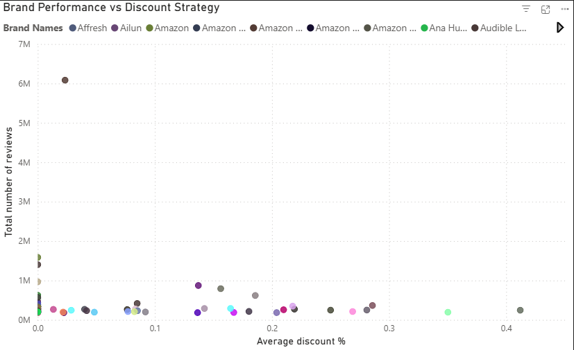

I fit a scatter plot to show the relationship between discount percentage (listedPrice - salesPrice) / listedPrice and total review count, again I decided to apply log scale for easier pattern interpretation. 

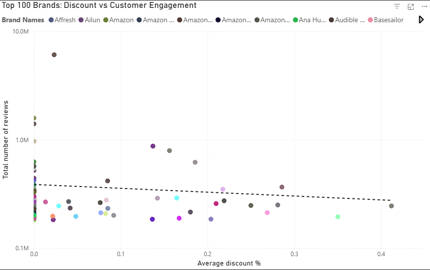

Here the outlier was removed from the plot to prevent the distortion of the axis scale.This ensured the distribution and trends of the remaining data points to be more clearly interpreted.

#### Observations:

* **Negative, but weak correlation:**  The scatterplot shows a slight downward trend, indicating that higher discounts do not meaningfully drive popularity or more reviews.

* **Brands offering large discounts aren’t necessarily seeing more customer engagement.** This suggests that aggressive pricing alone isn’t the main factor influencing best-seller status in this category.

* **Customer behaviour appears less price-sensitive**. Even products with smaller discounts can achieve high review counts, highlighting that brand reputation and recognition play a more significant role in driving sales and engagement.

* **Discounts are not a guaranteed driver of popularity**. Just as some highly discounted products fail to attract many reviews, the dataset indicates that other factors—like trust in the brand—matter more for converting interest into purchases.

## 4. Are bundled products more likely to become best sellers?
Bundled products often provide added value by combining multiple items into a single offering. This question investigates whether such bundles attract more customer engagement and are more likely to become best-sellers compared to single-item products.

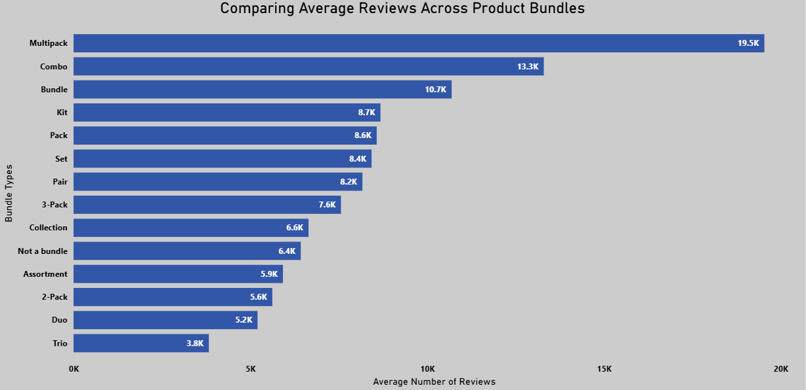

Here shows the graph of average number of reviews across different bundle types of products.
We can see that **Multipack** with a value of 19.5k reviews, suggesting that customers strongly engage with bulk products, likely due to value for money or frequent used products. Weakest bundle types are **Assortment, 2-pack, duo and trio**, smaller bundles have relatively lower customer engagement as it may possibly be perceived as less valuable.

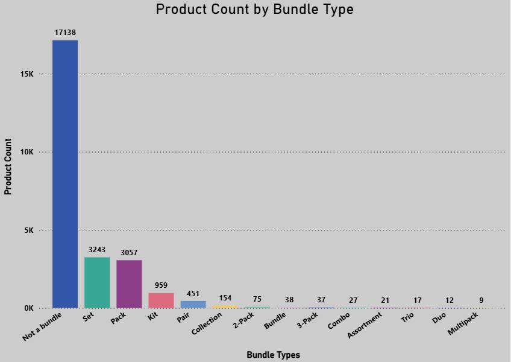

Here shows the graph of product count by bundle type. We can observe that **non-bundled(single-item) products dominate** with a value of 17.1k. This is followed by **set** and **pack** categories, which represent a smaller but still noticeable portion of products. In contrast, all other bundle types are relatively uncommon.

#### Overall observations:
* **Single-item products dominate in volume**, indicating that there are lot of sales of individual products rather than as bundles. This suggests simplicity in purchasing and listing is still the standard approach in the marketplace.
* **Multipacks generate significantly higher average reviews**, shows that although their presence may be low in best-sellers ranking, they attract much stronger engagement and more likely to perform well.
* **Smaller bundles(Assortment, duo, trio) products underperform within the best-sellers**, implying that they may nto provide enough value compared to larger bulk offerings.

