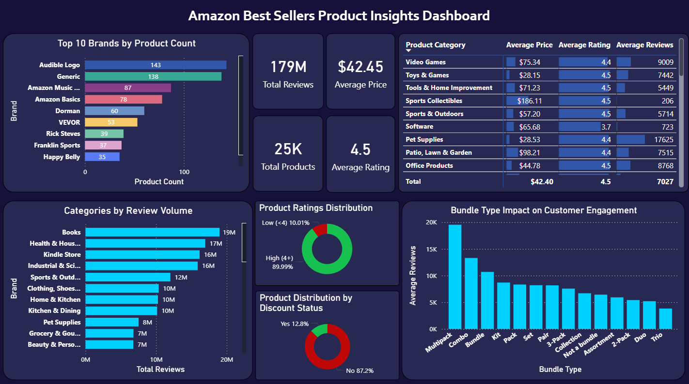

# End To End Amazon Best Sellers Intelligence Dashboard
This Dashboard project analyzes the Octaprice Amazon Best Sellers dataset, a collection of over 20,000 products extracted from Amazon's best seller pages across different categories and subcategories. 

## Why I made this Dashboard

I regularly shop on Amazon, just like millions of people around the world. Whether it's something like electronics or everyday household items, I have always noticed how certain products consistently appear in top search results and Top Deals page(Best seller lists). 

As someone who carefully checks product reviews and quality before making a purchase, I became curious about what actually drives those rankings. Some products with thousands of reviews dominate their categories, while others with fewer reviews still manage to rank highly. In some cases, higher-priced products ranked lower, while cheaper products ranked higher. Observing these inconsistencies made me realize that there must be hidden patterns and underlying factors that determine why certain products become best sellers. 

To analyze, I came up with 4 main questions:
* Do higher product ratings drive product popularity?
* Which Brands dominate Best-seller rankings across different categories?
* Are best-sellers driven by competitive pricing or brand power?
* Are bundled products more likely to become best sellers?

## Summary of Insights:
* **Product ratings have a positive but weak influence on popularity:**
    * Products with high ratings alone do not guarantee more reviews or sales.
    * Most products with very high reviews have ratings above 4.0, indicating a social proof effect.
    * Many highly rated products still have relatively few reviews.

* **Brand dominance is strong in certain categories:**
    * In curated or proprietary categories, Amazon's private labels—Audible, Amazon Music and Amazon Basics dominate.
    * One Brand frequently dominates niche markets like books, cars, and CDs/vinyl.
    * The brand presence is more dispersed in utility categories including groceries, kitchens and homes.
    * Strong brand reputation is often category-specific.
* **Pricing and discounts are not the main drivers of popularity:** 
    * Product reviews and the discount percentage have a weak negative correlation.
    * Excessive discounts do not necessarily increase customer engagement.
    * Customer behaviour appears more influenced by brand recognition or brand familirarity than price sensitivity.
* **Bundled products impact engagement differently than single items:**
    * Reviews for multipacks are much higher, likely due to their perceived value or frequent usage.
    * Single-item products dominate in volume, indicating standard purchase preferences and simplicity.
    * Smaller bundles(duo, trio, assortments) perform poorly, suggesting limited perceived value.

## General takeaway / Personal statement:
Brand power and social proof have a greater impact on best-seller popularity than the prices or ratings of the products alone. It can be seen that product type and bundle size do affect engagment, with products that are bulk or high-value bundles performing better on average. Market dynamics differ depending on the category, and success in one category does not necessarily imply success in others.  

My personal actionable advice for sellers and brands is to first focus on building customer trust to strengthen brand reputation, as this has a far greater chance on being a best-seller product. To promote long-term customer loyalty, avoid relying on excessive discounts and focus on emphasizing quality of the product and brand recognition. Next, actively promote social proof by looking for real customer reviews, as reviews and high ratings greatly increase the visibility of the product. Additionally, consider offering bulk or multipack products where relevant, as they tend to generate higher average of customer engagement. It is also essential to focus on category-specific strategies, because having dominance in one niche does not guarantee success in another.

## Dashboard:
I have created an extensive Power BI dashboard to offer a dynmaic view of the Amazon Best Sellers data. This dashboard enables deeper insights into what drives 
